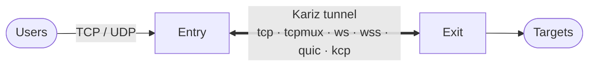
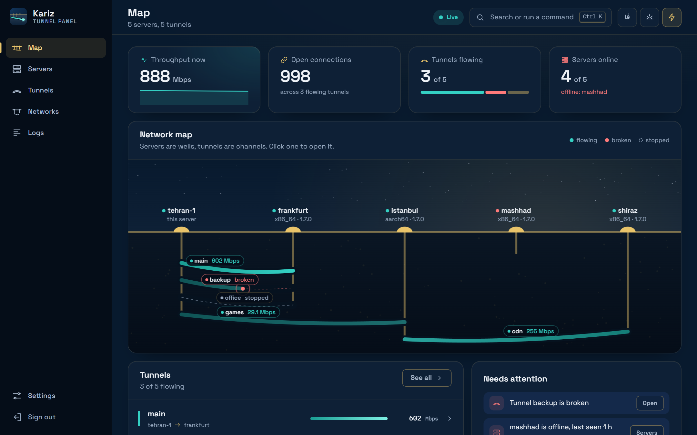
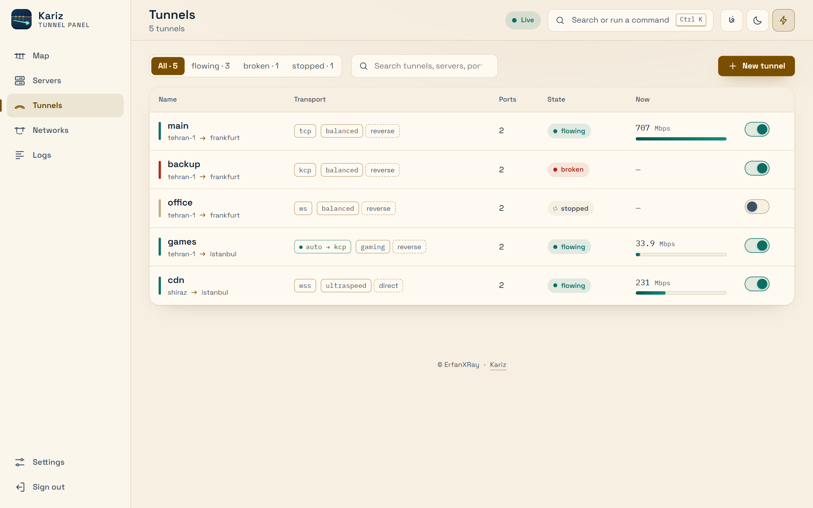
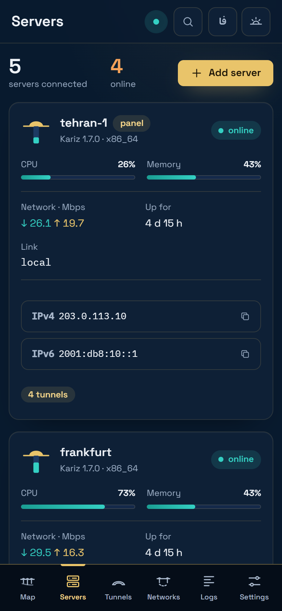

<p align="center">
  
</p>

<p align="center">
  <a href="https://github.com/Erfan-XRay/Kariz/actions/workflows/ci.yml"></a>
  <a href="https://github.com/Erfan-XRay/Kariz/releases"></a>
  
  
</p>

<p align="center">
  <b>English</b> · <a href="README_FA.md">فارسی</a> ·
  <a href="https://erfan-xray.github.io/Kariz/">Website</a> ·
  <a href="https://erfan-xray.github.io/Kariz/docs/">Documentation</a> ·
  <a href="https://erfan-xray.github.io/Kariz/try/">Live demo</a> ·
  <a href="CHANGELOG.md">Changelog</a>
</p>

---

**Kariz** (کاریز) takes its name from the qanats of Iran: channels dug under the desert that carry water
from the mountains to the villages, through a line of wells, without ever coming to the surface.
The software does the same for traffic. It joins two servers with a fast, encrypted tunnel; your
users connect to the **entry**, and Kariz carries their TCP and UDP traffic to the **exit**, which
reaches the real destinations.



It is one small Rust program (about 8 MiB of memory per side, no garbage collector), and a web panel
to run it: servers, tunnels, charts and logs in a browser.

<p align="center">
  
</p>

<table align="center">
  <tr>
    <td align="center" width="62%"></td>
    <td align="center" width="26%"></td>
  </tr>
</table>

## Install

On the server that will hold the panel, as root:

```bash
bash <(curl -fsSL https://raw.githubusercontent.com/Erfan-XRay/Kariz/main/scripts/kariz.sh)
```

The script finds your CPU (x86_64, aarch64 or armv7), downloads the latest release, checks its
signature and opens a menu. Choose **Install the web panel here**: it prints the panel's address and a
one-time login link. From then on you work in the browser. Add your other servers (each runs one command
with a code from the panel), then make a tunnel between any two of them with the wizard.

Want to look first? The [live demo](https://erfan-xray.github.io/Kariz/try/) runs the real panel on sample data.

## What you get

- **Six transports.** `tcp`, `tcpmux`, `ws` and `wss` (for CDNs and sites that must look like HTTPS), and
  `quic` and `kcp` over UDP for long or lossy paths. `quic` can be sealed packet by packet, so it does
  not look like QUIC to a network that filters it.
- **Both directions.** The exit can dial the entry (`reverse`) or the other way round (`direct`), with
  automatic reconnects.
- **TCP and UDP.** WireGuard, DNS and games work through it; on `kcp` and `quic` a lost packet delays
  nothing else, and games get FEC and optional packet duplication.
- **A panel that undoes its mistakes.** The tunnel wizard checks both servers first, and if anything fails
  it puts both back as they were. Live map, charts, logs, speed test, backups, private networks and
  updates are in the same place.
- **Alerts in Telegram.** Your own bot tells you when a server goes offline or a tunnel goes down (and
  when it is back), and answers `/status` with every server and tunnel. It can go through a proxy or a
  tunnel where Telegram is blocked. [Set it up](https://erfan-xray.github.io/Kariz/docs/telegram/).
- **Signed releases.** The install script, the panel and its agents verify a release's signature before
  they run anything from it.

## Documentation

Everything else is on the website, in English and Persian:

| | |
|---|---|
| [Getting started](https://erfan-xray.github.io/Kariz/docs/getting-started/) | install, the first tunnel, systemd |
| [Using the panel](https://erfan-xray.github.io/Kariz/docs/using-the-panel/) · [Guided tour](https://erfan-xray.github.io/Kariz/docs/tour/) · [Video tutorial](https://erfan-xray.github.io/Kariz/docs/video/) | the panel, page by page, and in two minutes of video |
| [The manager script](https://erfan-xray.github.io/Kariz/docs/manager/) | installing, updating, the menu |
| [Transports](https://erfan-xray.github.io/Kariz/docs/transports/) · [Which one?](https://erfan-xray.github.io/Kariz/docs/how-it-works/) | choosing and tuning |
| [Configuration reference](https://erfan-xray.github.io/Kariz/docs/configuration/) | every setting, default and limit |
| [UDP and games](https://erfan-xray.github.io/Kariz/docs/udp-and-games/) · [CDN](https://erfan-xray.github.io/Kariz/docs/cdn/) | specific setups |
| [Troubleshooting](https://erfan-xray.github.io/Kariz/docs/troubleshooting/) · [Security](https://erfan-xray.github.io/Kariz/docs/security/) | when something is wrong |
| [Changelog](https://erfan-xray.github.io/Kariz/docs/changelog/) | what changed in each version |

The same pages are the Markdown files in [`docs/`](docs/README.md) (Persian: [`docs/fa/`](docs/fa/README.md)).

## Build from source

```bash
cargo build --release                         # target/release/kariz
cargo test                                    # nginx tests run too when nginx is installed
cargo build --release --no-default-features   # without quic and kcp
```

The panel's web app is in `panel/web` (`npm ci && npm run build`), the website in `site/`. The design and the
protocol are described in [docs/ROADMAP.md](docs/ROADMAP.md).

## Support

Kariz is made by one person and is free to run on your own servers. If it helps you and you want it to go on,
you can donate; it is never required. Send each coin **only on the network shown next to it**: a coin sent on
another network cannot be recovered. (The same, in [English](docs/support.md) and [Persian](docs/fa/support.md), is on the website.)

| Coin | Network | Address |
|---|---|---|
| USDT | TRON (TRC20) | `TKM87mEXhUpEBzqvNxs1qjM4EddX6VMXmw` |
| Gram | TON | `UQDfjT-h4ENIrt_Sq5-zBy9TvhckniwSLCkS7zIVX4fVSaFw` |
| Bitcoin (BTC) | Bitcoin | `bc1qc4cgy5etuwj2375c5zqma7xmjtk59s5s49rfp5` |

A star on the repository, a report of a problem with its log, and a word to other server operators help just as much.

## License

Kariz is **source-available, not open source**. You may read the code and run the official releases on your
own servers; using the core (or anything in it) anywhere else, copying it or redistributing it is not allowed.
The full terms are in [LICENSE](LICENSE).

<p align="center"><sub>© ErfanXRay</sub></p>
