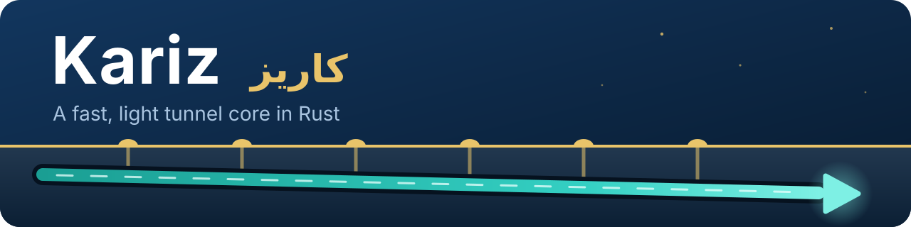

<p align="center">
  
</p>

<p align="center">
  <a href="https://github.com/Erfan-XRay/Kariz/actions/workflows/ci.yml"></a>
  <a href="https://github.com/Erfan-XRay/Kariz/releases"></a>
  
  
</p>

<p align="center">
  <b>English</b> · <a href="README_FA.md">فارسی</a> · <a href="docs/README.md">Documentation</a> · <a href="CHANGELOG.md">Changelog</a>
</p>

---

**Kariz** (کاریز, the ancient Persian underground water channel) links two servers with
a fast, encrypted tunnel. Users connect to the **entry** server; Kariz carries their
TCP and UDP traffic to the **exit** server, which reaches the real targets.


- 🪶 **Light.** No garbage collector, about 5 MiB of RAM per side. It runs on the
  cheapest VPS.
- 🔒 **Private.** Mutual authentication with a shared token, X25519 forward secrecy,
  and AEAD records without fixed bytes. It works through CDNs.
- ⚡ **Fast.** A statically dispatched hot path and tuned sockets: 4 Gbit/s encrypted
  on one connection on localhost, and transports that keep their speed on lossy links.

## ✨ Features

| Feature | What you get |
|---|---|
| **Six transports** | Plain `tcp`, multiplexed `tcpmux`, browser-like `ws` / `wss` for CDNs, and `quic` and `kcp` over UDP for lossy paths. |
| **Both directions** | `reverse` mode (the exit dials the entry) or `direct` mode, for every transport, with automatic reconnects. |
| **Mux** | Many user connections over a few long-lived ones, each stream with its own flow control, opened without a round trip. Every mux setting can be tuned. |
| **UDP forwarding** | WireGuard, games, DNS, QUIC over any transport. Over `quic` and `kcp` a lost packet delays nothing else. |
| **Profiles** | `balanced`, `ultraspeed` for the most speed, and `gaming` for low, steady latency. |
| **Gaming** | FEC that rebuilds lost packets, per-rule packet duplication, and optional DSCP marks. |
| **CDN ready** | Early data saves a round trip, pings keep idle connections alive, and anything else gets an nginx-style `404`. |
| **Easy to run** | One static binary, one TOML file per side, `kariz check` to validate, a systemd unit. |

## 🧭 Pick a transport

| Your path | Use |
|---|---|
| Clean, direct, most speed | `tcp` or `tcpmux` |
| Through a CDN or reverse proxy | `ws` / `wss` ([guide](docs/CDN.md)) |
| Should look like an HTTPS site | `wss` |
| Long or lossy (international, throttled) and UDP works | `kcp`, or `quic` with BBR |
| Games and voice | `kcp` with `profile = "gaming"` |

Details: [docs/transports.md](docs/transports.md).

## 🚀 Quick start

```bash
# 1. On both servers: install (or download from Releases)
cargo build --release && sudo cp target/release/kariz /usr/local/bin/

# 2. Make one token and use it on both sides
kariz token
```

```toml
# 3a. Entry (/etc/kariz/config.toml): users connect to port 443
role = "entry"
mode = "reverse"

[tunnel]
transport = "tcpmux"
listen = "0.0.0.0:3080"
token = "PASTE-THE-TOKEN"

[[forward]]
listen = "0.0.0.0:443"
target = "127.0.0.1:443"          # dialed on the exit
```

```toml
# 3b. Exit (/etc/kariz/config.toml): dials the entry
role = "exit"
mode = "reverse"

[tunnel]
transport = "tcpmux"
remote = "ENTRY_IP:3080"
token = "PASTE-THE-TOKEN"
```

```bash
# 4. Validate, then run as a service
kariz check -c /etc/kariz/config.toml
sudo cp systemd/kariz.service /etc/systemd/system/ && sudo systemctl enable --now kariz
```

Ready-made pairs for every transport are in [`configs/`](configs). The full walkthrough
is in [docs/getting-started.md](docs/getting-started.md).

## ⚙️ Profiles

| | `balanced` (default) | `ultraspeed` | `gaming` |
|---|---|---|---|
| For | most uses | bulk transfer, the most speed | games, voice |
| Mux stream window | 256 KiB | 1 MiB | 64 KiB |
| Mux connections | 4 | 8 | 2 |
| Relay buffer | 64 KiB | 256 KiB | 16 KiB |
| Write coalescing | on | on | off |
| Keepalive / ping | 30 s | 30 s | 10 s |
| KCP FEC | off | off | 10 / 3 |

Every value can be overridden. See [docs/profiles.md](docs/profiles.md).

## 🎮 Games

With `kcp` and the gaming profile, game packets never wait for a lost one, and FEC
rebuilds most losses within 20 ms. On an emulated 60 ms path with 1 % loss, the p99
round trip is **69 ms**, against 169 ms over `tcpmux`. With 5 % loss, 99 % of packets
still arrive. See [docs/udp-and-games.md](docs/udp-and-games.md) and the
[`gaming` sample configs](configs/entry-gaming.toml).

## 📊 Performance

| Measurement | Result |
|---|---|
| `tcp`, AES-256-GCM, localhost | 3.8-4.0 Gbit/s each way |
| `tcpmux`, AES-256-GCM, localhost | 3.2-3.3 Gbit/s |
| UDP through the tunnel | about 140,000 packets/s each way |
| Memory, idle | about 5-6 MiB per side |
| 60 ms path, 1 % loss: `tcpmux` / `kcp` / `quic` (BBR) | 2.3 / 28.5 / 47.4 Mbit/s |

Methods, tables and the benchmarks: [docs/performance.md](docs/performance.md).

## 📚 Documentation

| Page | Covers |
|---|---|
| [Getting started](docs/getting-started.md) | install, token, first tunnel, systemd |
| [Configuration reference](docs/configuration.md) | every setting, default and limit |
| [Transports](docs/transports.md) · [Profiles](docs/profiles.md) | choosing and tuning |
| [UDP and games](docs/udp-and-games.md) · [CDN](docs/CDN.md) | specific setups |
| [Performance](docs/performance.md) · [Security](docs/security.md) · [Troubleshooting](docs/troubleshooting.md) | running it well |

## 🛠️ Development

```bash
cargo fmt --all --check
cargo clippy --all-targets -- -D warnings
cargo test                                    # nginx tests run too when nginx is installed
cargo build --release --no-default-features   # without quic and kcp
```

Design documents: [roadmap](docs/ROADMAP.md) and the phase plans in [`docs/`](docs).
Changes by version: [CHANGELOG.md](CHANGELOG.md).
