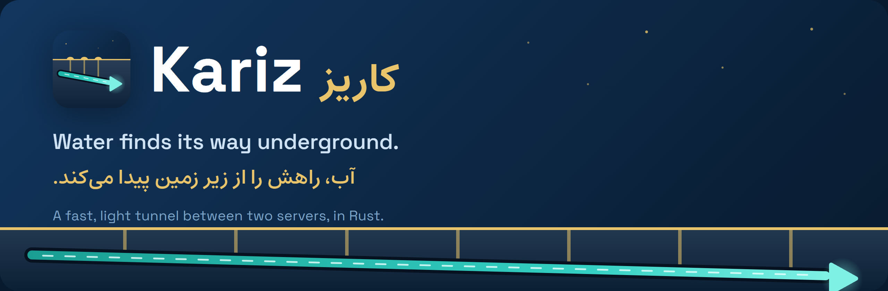
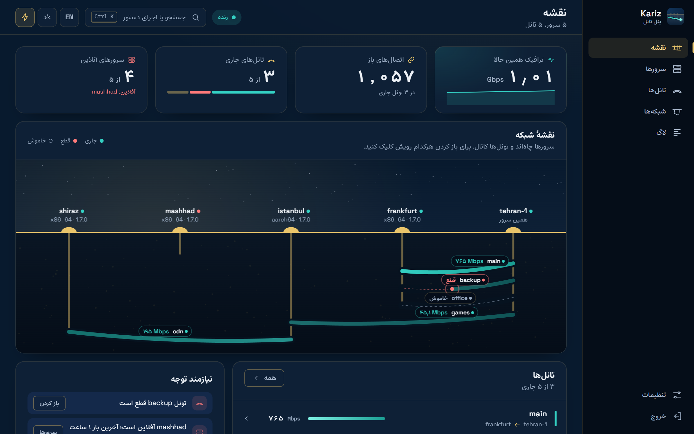
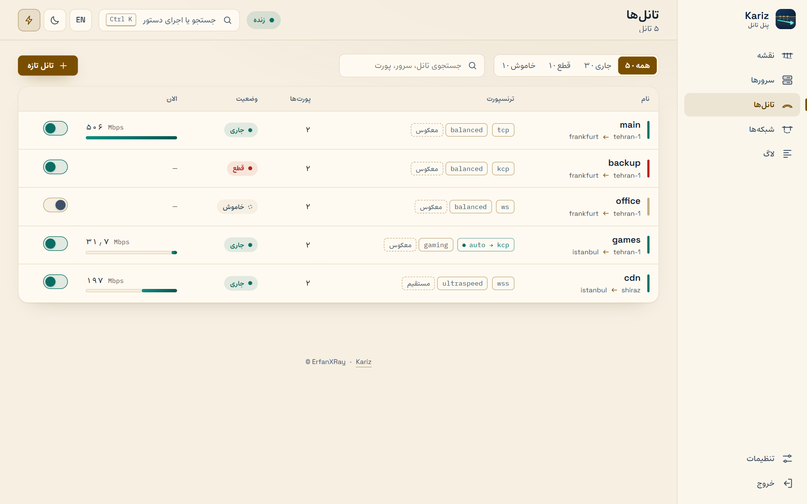
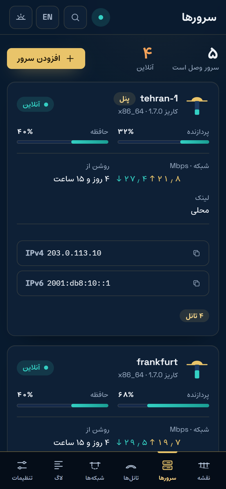

<p align="center">
  
</p>

<p align="center">
  <a href="https://github.com/Erfan-XRay/Kariz/actions/workflows/ci.yml"></a>
  <a href="https://github.com/Erfan-XRay/Kariz/releases"></a>
  
  
</p>

<p align="center">
  <a href="README.md">English</a> · <b>فارسی</b> ·
  <a href="https://erfan-xray.github.io/Kariz/fa/">وب‌سایت</a> ·
  <a href="https://erfan-xray.github.io/Kariz/fa/docs/">مستندات</a> ·
  <a href="https://erfan-xray.github.io/Kariz/fa/try/">دموی زنده</a> ·
  <a href="docs/fa/CHANGELOG.md">تغییرات</a>
</p>

---

<div dir="rtl">

**کاریز** نامش را از کاریزهای ایران گرفته: کانال‌هایی که زیر کویر کنده‌اند و آب را از دل کوه، از میان ردیفی از چاه‌ها، بی‌آن‌که به سطح زمین بیاید به آبادی می‌رسانند. این برنامه همین کار را برای ترافیک می‌کند. دو سرور را با یک تانل سریع و رمزنگاری‌شده به هم وصل می‌کند؛ کاربرها به **ورودی** (entry) وصل می‌شوند و کاریز ترافیک TCP و UDP‌شان را به **خروجی** (exit) می‌رساند، همان سروری که به مقصدهای واقعی دسترسی دارد.

</div>


<div dir="rtl">

خود برنامه یک فایل کوچک به زبان Rust است (حدود ۸ مگابایت حافظه برای هر سمت و بدون garbage collector) و برای اداره‌اش یک پنل وب دارد: سرورها، تانل‌ها، نمودارها و لاگ‌ها، همه در مرورگر.

</div>

<p align="center">
  
</p>

<table align="center">
  <tr>
    <td align="center" width="62%"></td>
    <td align="center" width="26%"></td>
  </tr>
</table>

<div dir="rtl">

## نصب

روی سروری که پنل را نگه می‌دارد، با دسترسی root:

</div>

```bash
bash <(curl -fsSL https://raw.githubusercontent.com/Erfan-XRay/Kariz/main/scripts/kariz.sh)
```

<div dir="rtl">

اسکریپت CPU سرور را تشخیص می‌دهد (x86_64، aarch64 یا armv7)، آخرین نسخه را می‌گیرد، امضایش را می‌سنجد و یک منو باز می‌کند. **نصب پنل وب** را انتخاب کنید تا نشانی پنل و یک لینک ورود یک‌بارمصرف چاپ شود. از آن به بعد کار در مرورگر است: سرورهای دیگرتان را اضافه کنید (هر کدام یک دستور را با کدی که پنل می‌دهد اجرا می‌کند) و با ویزارد بین هر دو سرور تانل بسازید.

می‌خواهید اول ببینید؟ [دموی زنده](https://erfan-xray.github.io/Kariz/fa/try/) پنل واقعی را با داده‌های نمونه اجرا می‌کند.

## چه چیزی دارد

- **شش ترنسپورت.** `tcp`، `tcpmux`، `ws` و `wss` (برای CDN و جایی که ترافیک باید شبیه HTTPS باشد) و `quic` و `kcp` روی UDP برای مسیرهای دور یا پراتلاف. `quic` را می‌شود بسته‌به‌بسته مهر و موم کرد تا برای شبکه‌ای که QUIC را فیلتر می‌کند شبیه QUIC نباشد.
- **هر دو جهت.** خروجی می‌تواند به ورودی وصل شود (`reverse`) یا برعکس (`direct`)، با اتصال دوبارهٔ خودکار.
- **TCP و UDP.** WireGuard، DNS و بازی از آن رد می‌شوند. روی `kcp` و `quic` بستهٔ گم‌شده چیز دیگری را معطل نمی‌کند و برای بازی FEC و تکثیر اختیاری بسته هم هست.
- **پنلی که اشتباهش را خودش جمع می‌کند.** ویزارد تانل اول هر دو سرور را می‌سنجد و اگر جایی خطا شود هر دو را به حالت قبل برمی‌گرداند. نقشهٔ زنده، نمودار، لاگ، تست سرعت، پشتیبان‌گیری، شبکهٔ خصوصی و به‌روزرسانی هم همان‌جاست.
- **اعلان در تلگرام.** رباتِ خودتان وقتی سروری آفلاین یا تانلی قطع شود (و وقتی برگردد) خبر می‌دهد و به `/status` با وضعیت همهٔ سرورها و تانل‌ها جواب می‌دهد. جایی که تلگرام بسته است از پروکسی یا از یک تانل رد می‌شود. [راه‌اندازی](https://erfan-xray.github.io/Kariz/fa/docs/telegram/).
- **انتشار امضاشده.** اسکریپت نصب، پنل و agentها پیش از اجرای هر چیزی از یک نسخه، امضایش را بررسی می‌کنند.

## مستندات

بقیهٔ مطالب در وب‌سایت است، به فارسی و انگلیسی:

| | |
|---|---|
| [شروع کار](https://erfan-xray.github.io/Kariz/fa/docs/getting-started/) | نصب، اولین تانل، systemd |
| [کار با پنل](https://erfan-xray.github.io/Kariz/fa/docs/using-the-panel/) · [تور راهنما](https://erfan-xray.github.io/Kariz/fa/docs/tour/) | پنل، صفحه به صفحه |
| [اسکریپت مدیر](https://erfan-xray.github.io/Kariz/fa/docs/manager/) | نصب، به‌روزرسانی، منو |
| [ترنسپورت‌ها](https://erfan-xray.github.io/Kariz/fa/docs/transports/) · [کدام یکی؟](https://erfan-xray.github.io/Kariz/fa/docs/how-it-works/) | انتخاب و تنظیم |
| [مرجع پیکربندی](https://erfan-xray.github.io/Kariz/fa/docs/configuration/) | همهٔ تنظیم‌ها با مقدار پیش‌فرض و محدوده |
| [UDP و بازی](https://erfan-xray.github.io/Kariz/fa/docs/udp-and-games/) · [CDN](https://erfan-xray.github.io/Kariz/fa/docs/cdn/) | راه‌اندازی‌های خاص |
| [عیب‌یابی](https://erfan-xray.github.io/Kariz/fa/docs/troubleshooting/) · [امنیت](https://erfan-xray.github.io/Kariz/fa/docs/security/) | وقتی چیزی درست کار نمی‌کند |
| [تغییرات](https://erfan-xray.github.io/Kariz/fa/docs/changelog/) | هر نسخه چه چیزی عوض شد |

همین صفحه‌ها فایل‌های Markdown پوشهٔ [`docs/fa/`](docs/fa/README.md) هستند (نسخهٔ انگلیسی: [`docs/`](docs/README.md)).

## ساخت از روی سورس

</div>

```bash
cargo build --release                         # target/release/kariz
cargo test                                    # اگر nginx نصب باشد تست‌های nginx هم اجرا می‌شوند
cargo build --release --no-default-features   # بدون quic و kcp
```

<div dir="rtl">

برنامهٔ وب پنل در `panel/web` است (`npm ci && npm run build`) و وب‌سایت در `site/`. طراحی و پروتکل در [docs/ROADMAP.md](docs/ROADMAP.md) شرح داده شده است.

## حمایت

کاریز را یک نفر می‌سازد و اجرایش روی سرورهای خودتان رایگان است. اگر به کارتان آمده و می‌خواهید ادامه پیدا کند، می‌توانید کمک مالی کنید؛ هیچ‌وقت لازم نیست. هر ارز را **فقط روی شبکه‌ای** بفرستید که کنارش نوشته شده: ارزی که روی شبکهٔ دیگری فرستاده شود برگردانده نمی‌شود. (همین مطلب در وب‌سایت هم هست: [فارسی](docs/fa/support.md) و [English](docs/support.md).)

</div>

| Coin | Network | Address |
|---|---|---|
| USDT | TRON (TRC20) | `TKM87mEXhUpEBzqvNxs1qjM4EddX6VMXmw` |
| Gram | TON | `UQDfjT-h4ENIrt_Sq5-zBy9TvhckniwSLCkS7zIVX4fVSaFw` |
| Bitcoin (BTC) | Bitcoin | `bc1qc4cgy5etuwj2375c5zqma7xmjtk59s5s49rfp5` |

<div dir="rtl">

ستاره دادن به مخزن، گزارش مشکل همراه با لاگ، و گفتن از کاریز به مدیران سرور دیگر هم به همان اندازه کمک می‌کند.

## مجوز

کاریز **کدباز نیست، «سورس‌در‌دسترس» است**. می‌توانید کد را بخوانید و نسخه‌های رسمی را روی سرورهای خودتان اجرا کنید؛ استفاده از هسته (یا هر بخشی از آن) در جای دیگر، کپی کردن یا پخش کردنش مجاز نیست. متن کامل شرایط در فایل [LICENSE](LICENSE) است (متن انگلیسی معتبر است).

<p align="center"><sub>© ErfanXRay</sub></p>

</div>
