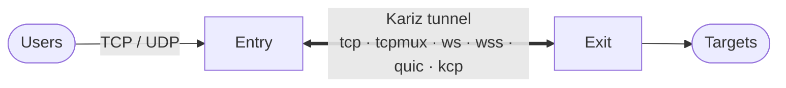

<p align="center">
  
</p>

<p align="center">
  <a href="https://github.com/Erfan-XRay/Kariz/actions/workflows/ci.yml"></a>
  <a href="https://github.com/Erfan-XRay/Kariz/releases"></a>
  
  
</p>

<p align="center">
  <a href="README.md">English</a> · <b>فارسی</b> · <a href="https://erfan-xray.github.io/Kariz/fa/">وب‌سایت</a> · <a href="docs/fa/README.md">مستندات</a> · <a href="CHANGELOG.md">تغییرات</a>
</p>

<div dir="rtl">

---

**کاریز** (به یاد کاریزهای کهن ایرانی، کانال‌های آب زیرزمینی) دو سرور را با یک تانل سریع و رمزشده به هم وصل می‌کند. کاربرها به سرور **entry** وصل می‌شوند و کاریز ترافیک TCP و UDP آن‌ها را به سرور **exit** می‌رساند که به مقصدهای واقعی وصل می‌شود.

</div>



<div dir="rtl">

- 🪶 **سبک:** بدون Garbage Collector و با حدود ۸ مگابایت RAM برای هر سمت؛ روی ارزان‌ترین VPSها هم اجرا می‌شود.
- 🔒 **امن:** احراز هویت دوطرفه با توکن مشترک، امنیت پیشرو با X25519، و رکوردهای رمزشده بدون هیچ بایت ثابت. از پشت CDN هم کار می‌کند.
- ⚡ **سریع:** مسیر داده بدون dispatch پویا و سوکت‌های تنظیم‌شده؛ روی localhost حدود ۴ گیگابیت بر ثانیه رمزشده روی یک اتصال، و transportهایی که روی لینک پرتلفات هم سرعتشان را حفظ می‌کنند.

## ✨ امکانات

| امکان | چه چیزی می‌دهد |
|---|---|
| **شش transport** | `tcp` ساده، `tcpmux` با mux، `ws` / `wss` شبیه مرورگر برای CDN، و `quic` و `kcp` روی UDP برای مسیرهای پرتلفات |
| **هر دو جهت** | حالت `reverse` (سرور exit به entry وصل می‌شود) یا `direct`، برای همه‌ی transportها و با اتصال دوباره‌ی خودکار |
| **mux** | اتصال‌های زیاد کاربر روی چند اتصال بلندمدت؛ هر stream کنترل جریان خودش را دارد و باز کردنش رفت‌وبرگشت اضافه ندارد. همه‌ی تنظیمات mux قابل تغییرند |
| **forward کردن UDP** | WireGuard، بازی، DNS و QUIC روی هر transportی؛ روی `quic` و `kcp` بسته‌ی گم‌شده چیز دیگری را معطل نمی‌کند |
| **پروفایل‌ها** | `balanced`، `ultraspeed` برای بیشترین سرعت، و `gaming` برای تأخیر کم و پایدار |
| **بازی** | FEC برای بازسازی بسته‌های گم‌شده، تکثیر بسته برای هر قانون، و علامت DSCP اختیاری |
| **تست سرعت** | `kariz speedtest` سرعت دانلود و آپلود، تأخیر زیر بار و loss در UDP را از داخل تانل زنده و در هر دو حالت می‌سنجد ([مستندات](docs/speedtest.md)) |
| **پنل وب** | پنلی با نقشهٔ زندهٔ سرورها و تانل‌ها: ساخت، ویرایش و حذف تانل بین دو سرور با ویزارد (اگر جایی خطا شود همه‌چیز برمی‌گردد)، نمودار، لاگ، تست سرعت و پشتیبان‌گیری؛ ورود با رمز یا لینک یک‌بارمصرف؛ سرورهای دیگر با یک دستور وصل می‌شوند ([مستندات](docs/panel.md)) |
| **وضعیت زنده** | `kariz status` روی هر دو سرور: سمت دیگر وصل است یا نه، زمان رفت‌وبرگشت، آخرین خطا و ترافیک هر پورت؛ با `--json` برای ابزارها ([مستندات](docs/status.md)) |
| **آماده برای CDN** | early data یک رفت‌وبرگشت صرفه‌جویی می‌کند، pingها اتصال بیکار را زنده نگه می‌دارند، و هر درخواست دیگری صفحه‌ی 404 شبیه nginx می‌گیرد |
| **اجرای آسان** | یک فایل اجرایی، یک فایل TOML برای هر سمت، `kariz check` برای بررسی، و سرویس systemd |

## 🧭 کدام transport؟

| مسیر شما | پیشنهاد |
|---|---|
| مسیر تمیز و مستقیم، بیشترین سرعت | `tcp` یا `tcpmux` |
| از پشت CDN یا reverse proxy | `ws` / `wss` ([راهنما](docs/CDN.md)) |
| باید شبیه یک سایت HTTPS باشد | `wss` |
| مسیر طولانی یا پرتلفات (بین‌المللی، محدودشده) و UDP کار می‌کند | `kcp`، یا `quic` با BBR |
| بازی و صدا | `kcp` با `profile = "gaming"` |

## 🚀 شروع سریع

### راه آسان: پنل وب

روی سروری که پنل را نگه می‌دارد، با دسترسی root، فقط یک خط:

</div>

```bash
bash <(curl -fsSL https://raw.githubusercontent.com/Erfan-XRay/Kariz/main/scripts/kariz.sh)
```

<div dir="rtl">

اسکریپت کاریز را برای CPU سرور (x86_64، aarch64 یا armv7) نصب می‌کند، امضای ریلیز را می‌سنجد و یک منو باز می‌کند: **۲** و بعد **install** را بزنید. آدرس پنل و یک لینک ورود یک‌بارمصرف چاپ می‌شود. از اینجا به بعد همه‌چیز در مرورگر است: سرورهای دیگر را اضافه کنید (هر کدام یک دستور با کد پیوستن اجرا می‌کند)، با ویزاردی که اگر جایی خطا شود همه‌چیز را برمی‌گرداند بینشان تانل بسازید، زنده تماشایشان کنید، سرعتشان را بسنجید و به‌روزشان کنید. پیش از نصب، صفحه‌ها را در [دموی زنده](https://erfan-xray.github.io/Kariz/fa/try/) ببینید؛ [docs/fa/using-the-panel.md](docs/fa/using-the-panel.md) قدم‌به‌قدم توضیح می‌دهد و [docs/fa/manager.md](docs/fa/manager.md) اسکریپت نصب را.

### راه دستی (بدون پنل)

۱. روی هر دو سرور نصب کنید (یا فایل اجرایی را از Releases بگیرید) و یک توکن بسازید که در هر دو سمت یکی باشد:

</div>

```bash
cargo build --release && sudo cp target/release/kariz /usr/local/bin/
kariz token
```

<div dir="rtl">

۲. کانفیگ سمت entry (کاربرها به پورت 443 وصل می‌شوند) و سمت exit (که به entry وصل می‌شود):

</div>

```toml
# Entry: /etc/kariz/config.toml
role = "entry"
mode = "reverse"

[tunnel]
transport = "tcpmux"
listen = "0.0.0.0:3080"
token = "PASTE-THE-TOKEN"

[[forward]]
listen = "0.0.0.0:443"
target = "127.0.0.1:443"          # dialed on the exit
```

```toml
# Exit: /etc/kariz/config.toml
role = "exit"
mode = "reverse"

[tunnel]
transport = "tcpmux"
remote = "ENTRY_IP:3080"
token = "PASTE-THE-TOKEN"
```

<div dir="rtl">

۳. بررسی و اجرا به‌صورت سرویس:

</div>

```bash
kariz check -c /etc/kariz/config.toml
sudo cp systemd/kariz.service /etc/systemd/system/ && sudo systemctl enable --now kariz
```

<div dir="rtl">

کانفیگ‌های آماده برای همه‌ی transportها در پوشه‌ی [`configs/`](configs) هستند:

| نمونه‌ها | کاربرد |
|---|---|
| `entry-reverse.toml` و `exit-reverse.toml` | حالت reverse روی `tcp` |
| `entry-direct.toml` و `exit-direct.toml` | حالت direct روی `tcp` |
| `entry-tcpmux-reverse.toml` و `exit-tcpmux-reverse.toml` | حالت reverse با mux |
| `entry-udp-reverse.toml` و `exit-udp-reverse.toml` | forward کردن UDP (WireGuard و سرور بازی) |
| `entry-wss-direct.toml` و `exit-wss-direct.toml` | `wss` مستقیم با گواهی self-signed که pin شده |
| `entry-wss-cdn.toml` و `exit-wss-cdn.toml` | `wss` از پشت CDN مثل Cloudflare |
| `entry-quic-direct.toml` و `exit-quic-direct.toml` | `quic`، با WireGuard روی datagramهای QUIC |
| `entry-kcp-reverse.toml` و `exit-kcp-reverse.toml` | `kcp` برای لینک پرتلفات |
| `entry-gaming.toml` و `exit-gaming.toml` | سرور بازی روی `kcp` با پروفایل gaming |

## ⚙️ پروفایل‌ها

| | `balanced` (پیش‌فرض) | `ultraspeed` | `gaming` |
|---|---|---|---|
| مناسب برای | بیشتر کاربردها | انتقال حجیم، بیشترین سرعت | بازی و صدا |
| پنجره‌ی هر stream در mux | 256 KiB | 1 MiB | 64 KiB |
| تعداد اتصال‌های mux | 4 | 8 | 2 |
| بافر relay | 64 KiB | 256 KiB | 16 KiB |
| یکی کردن نوشتن‌ها | روشن | روشن | خاموش |
| keepalive / ping | 30 ثانیه | 30 ثانیه | 10 ثانیه |
| FEC در KCP | خاموش | خاموش | ۱۰ / ۳ |

هر مقداری را می‌توان در `[tunnel.mux]`، `[tunnel.kcp]` یا `[tuning]` تغییر داد. `throughput` (اسم قبلی `ultraspeed`) هنوز پذیرفته می‌شود.

**برای بیشترین سرعت:** `profile = "ultraspeed"` را با transport مناسب مسیر ترکیب کنید: روی مسیر تمیز `tcp` یا `tcpmux`، و روی مسیر پرتلفات `kcp` یا `quic` با `congestion = "bbr"`. هر stream در هر رفت‌وبرگشت حداکثر به اندازه‌ی پنجره‌اش داده می‌برد، پس برای سرعت بیشتر `tunnel.mux.stream_window` را (تا ۱۶ مگابایت) بالا ببرید.

## 🔧 تنظیمات mux

| فیلد | توضیح |
|---|---|
| `connections` / `max_streams` / `stream_window` | تعداد اتصال‌های بلندمدت، حداکثر stream روی هر اتصال، و پنجره‌ی هر stream؛ پیش‌فرض از پروفایل |
| `coalesce` | یکی کردن فریم‌ها برای سرعت یا نوشتن فوری برای تأخیر کمتر |
| `ping_interval_secs` | فاصله‌ی ping؛ پشت CDN حداکثر ۹۰ |
| `datagram_buffer` / `datagram_queue` | اندازه‌ی صف‌های UDP |
| `notsent_lowat` | حد داده‌ی ارسال‌نشده در کرنل روی اتصال‌های mux؛ ۰ یعنی خاموش |
| `max_lifetime_secs` | عوض کردن دوره‌ای اتصال‌ها |

## 🎮 بازی

با `kcp` و پروفایل gaming، بسته‌های بازی هیچ‌وقت منتظر بسته‌ی گم‌شده نمی‌مانند و FEC بیشتر بسته‌های گم‌شده را در حدود ۲۰ میلی‌ثانیه بازسازی می‌کند. روی مسیر شبیه‌سازی‌شده‌ی ۶۰ میلی‌ثانیه‌ای با ۱٪ loss، p99 رفت‌وبرگشت **۶۹ میلی‌ثانیه** است، در مقابل ۱۶۹ روی `tcpmux`؛ با ۵٪ loss هم ۹۹٪ بسته‌ها می‌رسند. با `duplicate = 2` روی قانون forward بازی، هر بسته دو بار فرستاده می‌شود (فقط روی قانون‌های بازی یا صدا، نه WireGuard).

## 📊 کارایی

| اندازه‌گیری | نتیجه |
|---|---|
| `tcp` با AES-256-GCM روی localhost | ۳٫۸ تا ۴ گیگابیت بر ثانیه در هر جهت |
| `tcpmux` با AES-256-GCM روی localhost | ۳٫۲ تا ۳٫۳ گیگابیت بر ثانیه |
| UDP از داخل تانل | حدود ۱۴۰ هزار بسته در ثانیه در هر جهت |
| حافظه در حالت بیکار | حدود ۸ مگابایت برای هر سمت (۶ مگابایت بدون mimalloc) |
| مسیر ۶۰ میلی‌ثانیه با ۱٪ loss: `tcpmux` / `kcp` / `quic` (BBR) | ۲٫۳ / ۲۸٫۵ / ۴۷٫۴ مگابیت بر ثانیه |

## 📚 مستندات

همهٔ مستندات به فارسی در [`docs/fa/`](docs/fa/README.md) است:

| صفحه | موضوع |
|---|---|
| [شروع کار](docs/fa/getting-started.md) · [کار با پنل](docs/fa/using-the-panel.md) | نصب، پنل، اولین تانل |
| [مرجع پیکربندی](docs/fa/configuration.md) | همهٔ تنظیمات با مقدار پیش‌فرض و محدوده |
| [ترنسپورت‌ها](docs/fa/transports.md) · [پروفایل‌ها](docs/fa/profiles.md) | انتخاب و تنظیم |
| [UDP و بازی](docs/fa/udp-and-games.md) · [CDN](docs/fa/CDN.md) | راه‌اندازی‌های خاص |
| [کارایی](docs/fa/performance.md) · [امنیت](docs/fa/security.md) · [عیب‌یابی](docs/fa/troubleshooting.md) | اجرای درست |

## 🔒 نکته‌های امنیتی

- توکن تنها راز است و هر کسی آن را داشته باشد می‌تواند از تانل استفاده کند. آن را با `kariz token` بسازید و فایل کانفیگ را فقط برای root قابل خواندن کنید (`chmod 600`).
- `encryption = "none"` فقط احراز هویت می‌کند و ترافیک روی شبکه خواناست.
- پشت CDN، اتصال TLS در خود CDN تمام می‌شود، اما رمزنگاری خود تانل محتوا را از CDN هم پنهان نگه می‌دارد.

## 🛠️ توسعه

</div>

```bash
cargo fmt --all --check
cargo clippy --all-targets -- -D warnings
cargo test                                    # nginx tests run too when nginx is installed
cargo build --release --no-default-features   # without quic and kcp
```

<div dir="rtl">

طراحی و پروتکل: [docs/ROADMAP.md](docs/ROADMAP.md). فهرست تغییرات هر نسخه: [CHANGELOG.md](CHANGELOG.md).

## 📄 مجوز

کاریز **کدباز نیست، «سورس‌در‌دسترس» است**: می‌توانید کد را بخوانید و ریلیزهای رسمی را روی سرورهای خودتان اجرا کنید؛ استفاده از هسته (یا هر بخشی از آن) در جای دیگر، کپی کردن یا پخش کردنش مجاز نیست. متن کامل شرایط در فایل [LICENSE](LICENSE) است (متن انگلیسی معتبر است).

</div>
