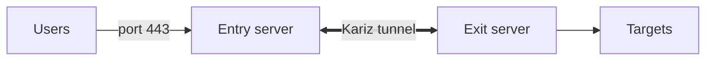

# شروع کار

[English](../getting-started.md) · **فارسی**

کاریز دو سرور را با یک تانل به هم وصل می‌کند:

- **entry** سرور عمومی است که کاربرها به آن وصل می‌شوند. قانون‌های `[[forward]]` مال آن است: «هر چه روی این پورت رسید، به آن آدرس بفرست».
- **exit** سروری است که به مقصدهای واقعی می‌رسد. آدرس‌هایی را که entry می‌خواهد وصل می‌شود.



اینکه کدام سمت تانل را باز می‌کند **mode** است:

| Mode | چه کسی وصل می‌شود | کی انتخابش کنید |
|---|---|---|
| `reverse` | exit به entry وصل می‌شود | entry می‌تواند اتصال ورودی از exit بگیرد |
| `direct` | entry به exit وصل می‌شود | exit می‌تواند اتصال ورودی بگیرد (یا پشت CDN است) |

سمتی که وصل می‌شود `tunnel.remote` را می‌گذارد و سمت دیگر `tunnel.listen` را.

## راه سریع

اسکریپت مدیر همهٔ مرحله‌های پایین را برایتان انجام می‌دهد، از جمله یک سرویس systemd برای هر تانل و دستوری که باید روی سرور دیگر اجرا شود:

```bash
bash <(curl -fsSL https://raw.githubusercontent.com/Erfan-XRay/Kariz/main/scripts/kariz.sh)
```

[اسکریپت مدیر](manager.md) را ببینید. بقیهٔ این صفحه همین کار است به‌صورت دستی. اگر پنل وب می‌خواهید، [پنل](panel.md) را بخوانید.

## ۱. نصب

فایل اجرایی استاتیک لینوکس را برای CPU خودتان (`x86_64`، `aarch64` یا `armv7`؛ دستور `uname -m` می‌گوید کدام) از [Releases](https://github.com/Erfan-XRay/Kariz/releases) بگیرید، یا با Rust نسخهٔ ۱٫۸۰ یا بالاتر خودتان بسازید:

```bash
cargo build --release
sudo cp target/release/kariz /usr/local/bin/
```

این کار را روی هر دو سرور انجام دهید.

## ۲. ساخت token

```bash
kariz token
```

token تنها رازِ تانل است: هر دو سمت یکی را دارند و هر کس آن را داشته باشد می‌تواند از تانل استفاده کند. هرگز روی شبکه فرستاده نمی‌شود.

## ۳. نوشتن دو کانفیگ

از یک جفت در [`configs/`](../../configs) شروع کنید:

| جفت | حالت |
|---|---|
| `entry-reverse.toml`، `exit-reverse.toml` | حالت reverse روی `tcp` ساده |
| `entry-direct.toml`، `exit-direct.toml` | حالت direct روی `tcp` ساده |
| `entry-tcpmux-reverse.toml`، `exit-tcpmux-reverse.toml` | حالت reverse با mux |
| `entry-udp-reverse.toml`، `exit-udp-reverse.toml` | فوروارد UDP (وایرگارد، بازی) |
| `entry-wss-direct.toml`، `exit-wss-direct.toml` | `wss` به سرور خودتان، با گواهی خودامضا و پین |
| `entry-wss-cdn.toml`، `exit-wss-cdn.toml` | `wss` از راه CDN ([راهنما](../CDN.md)) |
| `entry-quic-direct.toml`، `exit-quic-direct.toml` | `quic`، با وایرگارد روی datagramهای QUIC |
| `entry-kcp-reverse.toml`، `exit-kcp-reverse.toml` | `kcp` برای خط پرافت |
| `entry-gaming.toml`، `exit-gaming.toml` | سرور بازی روی `kcp` با پروفایل gaming |

یک جفت حداقلی در حالت reverse:

```toml
# /etc/kariz/config.toml on the entry
role = "entry"
mode = "reverse"

[tunnel]
transport = "tcpmux"
listen = "0.0.0.0:3080"            # the exit connects here
token = "PASTE-THE-TOKEN"

[[forward]]
listen = "0.0.0.0:443"             # users connect here
target = "127.0.0.1:443"           # dialed by the exit
```

```toml
# /etc/kariz/config.toml on the exit
role = "exit"
mode = "reverse"

[tunnel]
transport = "tcpmux"
remote = "ENTRY_IP:3080"
token = "PASTE-THE-TOKEN"
```

`target` **روی exit** پیدا و وصل می‌شود؛ پس `127.0.0.1:443` یعنی پورت ۴۴۳ خودِ سرور exit.

## ۴. بررسی و اجرا

```bash
kariz check -c /etc/kariz/config.toml    # validates, prints a summary and warnings
kariz run -c /etc/kariz/config.toml
```

اول سمتی را که گوش می‌دهد راه بیندازید؛ هرچند سمتی که وصل می‌شود تا وقتی بتواند وصل شود دوباره تلاش می‌کند.

## ۵. اجرا به‌صورت سرویس

```bash
sudo cp systemd/kariz.service /etc/systemd/system/
sudo systemctl enable --now kariz
journalctl -u kariz -f
```

این unit فایل `/etc/kariz/config.toml` را می‌خواند، اگر کاریز بایستد دوباره راهش می‌اندازد و دسترسی لازم برای پورت‌های زیر ۱۰۲۴ را می‌دهد.

## بعدش

- ترنسپورت مناسب مسیرتان را انتخاب کنید: [Transports](../transports.md) (انگلیسی).
- برای سرعت یا تأخیر تنظیم کنید: [Profiles](../profiles.md) (انگلیسی).
- همهٔ تنظیم‌ها: [مرجع کانفیگ](../configuration.md) (انگلیسی).
- پنل وب برای مدیریت چند سرور: [پنل](panel.md).
