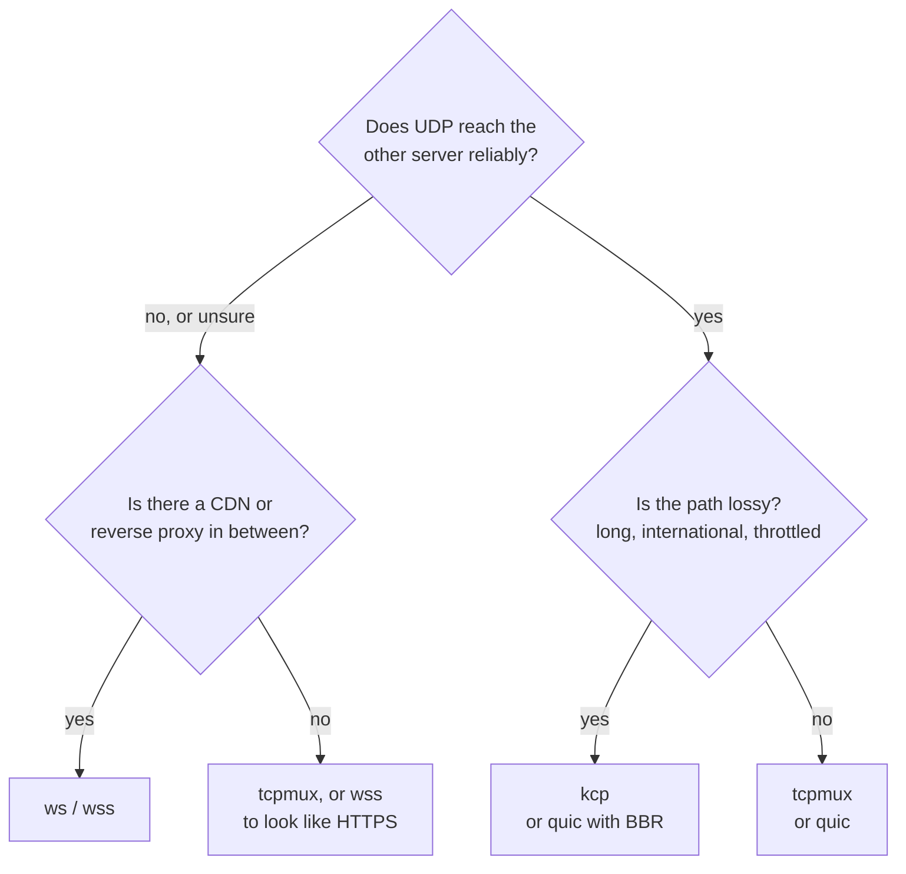

# ترنسپورت‌ها

[English](../transports.md) · **فارسی**

ترنسپورت راهی است که تانل بین دو سرور از آن می‌گذرد. فقط یک خط است، `tunnel.transport`، و باید روی هر دو سمت یکی باشد.

| ترنسپورت | روی شبکه چه می‌رود | کی انتخابش کنید |
|---|---|---|
| `tcp` | برای هر اتصال کاربر یک اتصال TCP | تنظیم‌های ساده، بیشترین سرعت روی یک اتصال |
| `tcpmux` | چند اتصال TCP بلندمدت که همهٔ اتصال‌های کاربرها را می‌برند | اتصال‌های کاربرِ زیاد؛ اتصال کمتر بین دو سرور |
| `ws` | WebSocket روی TCP (HTTP) | پشت CDN یا reverse proxy که با سرور اصلی با HTTP حرف می‌زند |
| `wss` | WebSocket روی TLS (HTTPS) | پشت CDN، یا وقتی می‌خواهید ترافیک شبیه یک سایت HTTPS باشد |
| `quic` | QUIC روی UDP: streamها و datagramها، با TLS 1.3 | جریان‌های UDP بدون head-of-line blocking؛ مسیرهایی که UDP در آن‌ها خوب کار می‌کند |
| `kcp` | KCP روی UDP، هر بسته رمزشده، با FEC اختیاری | مسیرهای پراتلاف که TCP در آن‌ها از پا می‌افتد؛ بازی |

همهٔ ترنسپورت‌ها جز `quic` لایه‌های یکسانی را روی خود اجرا می‌کنند: handshake (احراز هویت دوطرفه با توکن، و X25519 برای forward secrecy)، رکوردهای AEAD و mux.

## `tcp` و `tcpmux`

`tcp` برای هر اتصال کاربر یک اتصال تانل باز می‌کند. در حالت reverse، خروجی به تعداد `pool` اتصال آماده نگه می‌دارد تا کاربر تازه برای handshake منتظر نماند؛ در حالت direct، اولین بایت‌های کاربر همراه handshake می‌روند.

`tcpmux` همان `tcp` است، با mux: چند اتصال بلندمدت که هر کدام streamهای زیادی را حمل می‌کنند و هر stream کنترل جریان خودش را دارد. باز کردن یک stream هیچ رفت‌وبرگشتی لازم ندارد. روی لینوکس کاریز روی این اتصال‌ها `TCP_NOTSENT_LOWAT` را تنظیم می‌کند تا هسته صفی از داده نگه ندارد که بسته‌های UDP و streamهای تازه پشتش معطل بمانند.

روی مسیر تمیز، هر دو سریع‌ترین انتخاب‌اند. روی مسیر پراتلاف، کنترل ازدحام TCP با هر اتلاف سرعتش را نصف می‌کند: با ۱٪ اتلاف روی مسیری با ۶۰ میلی‌ثانیه تأخیر، حدود ۲ مگابیت بر ثانیه.

## `ws` و `wss`

یک WebSocket که شبیه مرورگر رفتار می‌کند، روی HTTP ساده (`ws`) یا TLS (`wss`). از CDN و reverse proxy رد می‌شوند ([راهنما](CDN.md)).

- **Early data** (`ws.early_data = true` روی سمت وصل‌شونده) پیام اول تانل را داخل درخواست upgrade می‌گذارد و یک رفت‌وبرگشت در مسیر CDN صرفه‌جویی می‌کند.
- **هر چیزی که upgrade معتبر نباشد** روی مسیر تنظیم‌شده صفحهٔ `404` یک nginx معمولی را می‌گیرد.
- **گواهی `wss`:** یا یک گواهی واقعی (Let's Encrypt) که با عوض شدن فایل‌ها دوباره بارگذاری می‌شود، یا یک گواهی خودامضا که سمت وصل‌شونده با `tls.pin_sha256` آن را pin می‌کند (`kariz pin cert.pem`).
- پشت CDN، فاصلهٔ ping را ۹۰ ثانیه یا کمتر نگه دارید؛ CDN وب‌سوکت‌های بی‌کار را حدود ۱۰۰ ثانیه بعد می‌بندد. `kariz check` در غیر این صورت هشدار می‌دهد.

## `quic`

QUIC (با quinn) روی UDP:

- هر اتصال کاربر stream خودش را در QUIC دارد: بستهٔ گم‌شده فقط stream خودش را عقب می‌اندازد.
- جریان‌های UDP به‌شکل datagramهای QUIC می‌روند. بسته‌هایی که برای یک datagram بزرگ‌اند (بالای حدود ۱٬۲۰۰ بایت) روی stream همان جریان می‌روند و باز هم می‌رسند.
- دو سمت توکن را با TLS 1.3 دوطرفه و با کلیدهایی که از آن ساخته می‌شود اثبات می‌کنند؛ فایل گواهی لازم نیست.
- کنترل ازدحام: `cubic` (پیش‌فرض)، `bbr` (زیر اتلاف تصادفی سرعتش را نگه می‌دارد، ولی صف‌ها را پر می‌کند و در quinn آزمایشی است) یا `newreno`.
- handshake شبیه HTTP/3 دیده می‌شود (ALPN برابر `h3` و SNI نام میزبان مقابل)، مگر این‌که `obfs` روشن باشد.

بعضی شبکه‌ها UDP را کند یا مسدود می‌کنند، به‌ویژه UDP روی پورت ۴۴۳. `quic` را گزینه‌ای برای مسیرهایی بدانید که UDP در آن‌ها کار می‌کند، و `tcpmux` یا `wss` را جایگزینش نگه دارید.

### `obfs`

بسته‌های اول QUIC را هر کسی می‌تواند بخواند. پس شبکه‌ای که دنبال QUIC می‌گردد (و روی SNI آن فیلتر می‌کند) می‌تواند آن را تشخیص بدهد و بیندازد، حتی جایی که UDP‌های دیگر رد می‌شوند. اگر در `[tunnel.quic]` روی **هر دو سمت** `obfs = true` بگذارید، هر بستهٔ UDP با کلیدی که از توکن می‌آید مهر و موم می‌شود (ChaCha20-Poly1305، مثل `kcp`). آن‌وقت روی سیم هدر QUIC و شمارهٔ نسخه‌ای برای تطبیق دادن نیست و پورت به چیزی که با توکن مهر نشده باشد جواب نمی‌دهد. درون تانل چیزی عوض نمی‌شود: handshake در TLS 1.3 و streamها مثل قبل کار می‌کنند.

- برای هر بسته ۲۸ بایت خرج دارد (اندازهٔ بستهٔ QUIC همان‌قدر کم می‌شود، پس بسته‌های روی سیم هم‌اندازه می‌مانند) و کمی CPU.
- هر دو سمت باید یک جور تنظیم شده باشند. سمتی که آن را نمی‌فهمد فقط نویز می‌بیند و سمت دیگر هنگام اتصال timeout می‌خورد. در ویزارد تانل پنل، این یک کلید زیر ترنسپورت است که برای `quic` پیش‌فرض روشن است.
- این گزینه پروتکل را پنهان می‌کند، نه این‌که UDP به این آدرس می‌رود. جایی که کل UDP بسته است کمکی نمی‌کند (از `tcpmux` یا `wss` استفاده کنید).

لینک پنل با سرورها هم می‌تواند `quic` باشد و آن همیشه مهر و موم‌شده است، بی‌هیچ تنظیمی: [پنل وب](panel.md#وصل-کردن-سرور-دیگر).

## `kcp`

KCP یک پروتکل ARQ روی UDP است که با شدت دوباره می‌فرستد و زیر اتلاف سرعتش را نگه می‌دارد، یعنی همان‌جا که TCP از پا می‌افتد.

- **هر بستهٔ UDP مهر و موم می‌شود** با کلیدی از توکن، پس پورت به هیچ چیز دیگری جواب نمی‌دهد و هدرهای KCP پنهان می‌مانند. handshake، رکوردها و mux مثل TCP داخل آن اجرا می‌شوند.
- **پیش‌تنظیم‌ها** از ملایم تا تند (`normal`، `fast`، `fast2`، `fast3`) یا `manual`.
- **FEC** (`fec_data` / `fec_parity`): بسته‌های parity از نوع Reed-Solomon بسته‌های گم‌شده را بدون ارسال دوباره بازسازی می‌کنند. پروفایل gaming آن را روی ۱۰ / ۳ می‌گذارد.
- **جریان‌های UDP کنار stream در KCP می‌روند** و هیچ‌وقت منتظر segment گم‌شده نمی‌مانند. با FEC روشن بیشتر بسته‌های گم‌شده بازسازی می‌شوند. با `datagrams = false` آن‌ها هم داخل stream می‌مانند.
- **پنجرهٔ آن می‌تواند مسیر کوچک را پر کند.** پیش‌فرض (۱۰۲۴ بسته) برای لینک‌های سریع اندازه شده؛ مقدار پهنای‌باند × RTT / 1300 بسته صف کمتری می‌سازد.

KCP در فضای کاربر و بسته‌به‌بسته اجرا می‌شود، پس روی localhost فقط به کسری از سرعت TCP می‌رسد (صدها مگابیت بر ثانیه). بین دو سرور معمولاً اهمیتی ندارد.

## `wss` با گواهی واقعی

گوش‌دهندهٔ `wss` به‌طور پیش‌فرض یک گواهی خودامضا می‌دهد که سمت وصل‌شونده pin می‌کند. در پنل می‌توانید به‌جای آن *Let's Encrypt* را انتخاب کنید، یک دامنه (یا آدرس IPv4 عمومی) بدهید که به سرور گوش‌دهنده اشاره می‌کند و دکمه را بزنید. سرور `kariz-manager tunnel-cert` را اجرا می‌کند؛ آن هرچه پورت ۸۰ را گرفته چند ثانیه متوقف می‌کند، گواهی را می‌گیرد و تایمر تمدید را راه می‌اندازد. بعد تانل فایل‌های زیر `/etc/letsencrypt/live/` را نام می‌برد (`tunnel.tls.cert` و `key`)، هنگام تمدید دوباره می‌خواندشان، و سمت وصل‌شونده گواهی را با ریشه‌های وب می‌سنجد (بدون pin؛ به دامنه وصل می‌شود).

## `auto`

`transport = "auto"` برای شبکه‌هایی است که نمی‌دانید از کدام راه رد می‌شوند، یا راهی که کار می‌کرد از کار افتاده. سمتی که گوش می‌دهد همهٔ این‌ها را هم‌زمان باز می‌کند:

| ترنسپورت | پورت |
|---|---|
| `tcpmux` | TCP، پورت خود تانل |
| `kcp` | UDP، همان شمارهٔ پورت |
| `ws` | TCP، پورت بعدی (مسیر وب‌سوکت از توکن ساخته می‌شود) |

سمت وصل‌شونده با همان راهی شروع می‌کند که آخرین بار کار کرد. اگر وصل شدن چهار ثانیه گیر کند یا شکست بخورد، سراغ بعدی می‌رود و همین‌طور دور می‌زند، و آن را که رد شد به یاد می‌سپارد. این حالت همیشه mux دارد و هر ۲ ثانیه ping می‌زند (`tunnel.mux.ping_interval_secs` آن را عوض می‌کند)؛ پس لینکی که ساکت شود حدود ۴ ثانیه بعد رها می‌شود و با هر ترنسپورتی که رد شود دوباره ساخته می‌شود. هر سه پورت باید سمت گوش‌دهنده باز باشند. اگر پورت UDP یا `ws` گرفته شده باشد، آن ترنسپورت کنار گذاشته می‌شود (و در لاگ می‌آید)، ولی `tcpmux` باید بتواند bind شود. `[tunnel.kcp]` برای بخش KCP آن اعمال می‌شود؛ `[tunnel.ws]` و `[tunnel.tls]` به کار نمی‌روند.

## حالت‌ها و ترنسپورت‌ها

هر ترنسپورتی در هر دو حالت کار می‌کند. سمتی که گوش می‌دهد باید پورتش در دسترس باشد: TCP برای `tcp`، `tcpmux`، `ws` و `wss`، و UDP برای `quic` و `kcp`.
