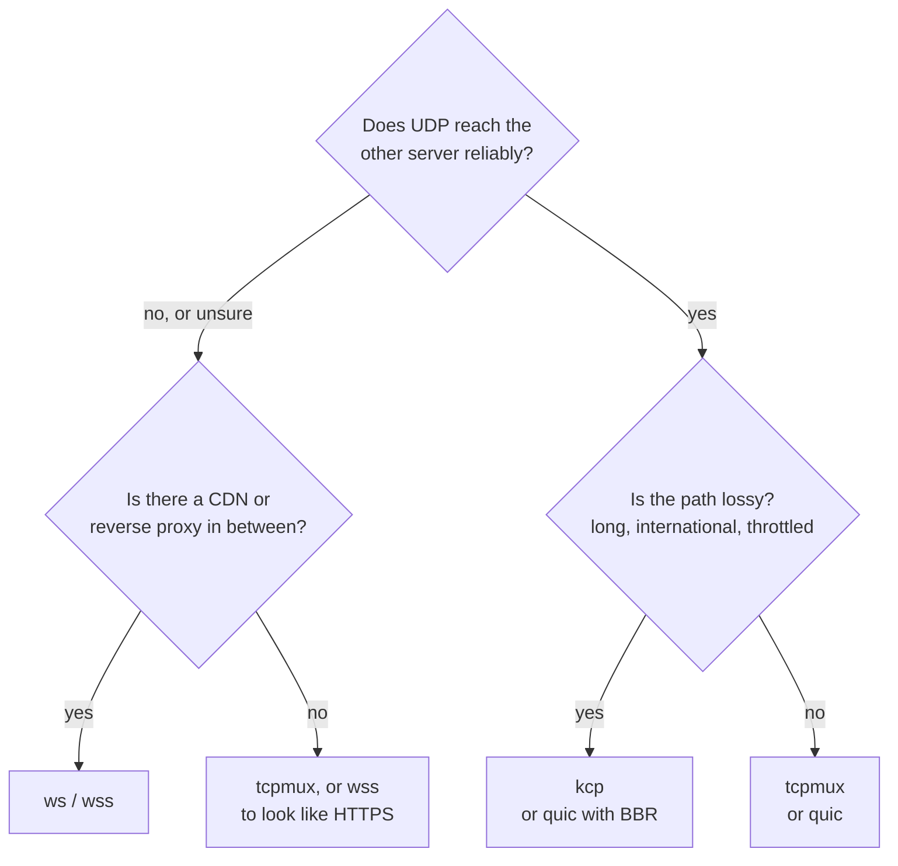

# ترنسپورت‌ها

[English](../transports.md) · **فارسی**

ترنسپورت راهی است که تانل بین دو سرور می‌رود. یک خط است، `tunnel.transport`، و باید روی هر دو سمت یکی باشد.

| ترنسپورت | چه چیزی روی شبکه می‌رود | کی استفاده‌اش کنید |
|---|---|---|
| `tcp` | برای هر اتصال کاربر یک اتصال TCP | تنظیم‌های ساده، بیشترین سرعت روی یک اتصال |
| `tcpmux` | چند اتصال TCP بلندمدت که همهٔ اتصال‌های کاربرها را می‌برند | اتصال‌های کاربرِ زیاد؛ اتصال کمتر بین دو سرور |
| `ws` | WebSocket روی TCP (HTTP) | پشت CDN یا reverse proxy که با origin به HTTP حرف می‌زند |
| `wss` | WebSocket روی TLS (HTTPS) | پشت CDN، یا تنها برای اینکه شبیه یک سایت HTTPS باشد |
| `quic` | QUIC روی UDP: streamها و datagramها، TLS 1.3 | جریان‌های UDP بدون head-of-line blocking؛ مسیرهایی که UDP روی آن‌ها خوب کار می‌کند |
| `kcp` | KCP روی UDP، هر بسته رمزشده، FEC اختیاری | لینک‌های پرتلفات که TCP روی آن‌ها فرو می‌ریزد؛ بازی |

هر چیزی جز `quic` همان لایه‌ها را روی خودش اجرا می‌کند: handshake (احراز هویت دوطرفه با token، X25519 برای forward secrecy)، recordهای AEAD و mux.

## `tcp` و `tcpmux`

`tcp` برای هر اتصال کاربر یک اتصال تانل باز می‌کند. در حالت reverse، exit به تعداد `pool` اتصال آماده نگه می‌دارد تا کاربر تازه منتظر handshake نماند؛ در حالت direct، اولین بایت‌های کاربر همراه handshake می‌روند.

`tcpmux` همان `tcp` است با mux: چند اتصال بلندمدت که هرکدام streamهای زیادی را با کنترل جریان خودشان می‌برند. باز کردن یک stream رفت‌وبرگشتی نمی‌خواهد. روی لینوکس کاریز روی این اتصال‌ها `TCP_NOTSENT_LOWAT` را می‌گذارد تا هسته صفی نگه ندارد که بسته‌های UDP و streamهای تازه پشتش منتظر بمانند.

هر دو روی مسیر تمیز سریع‌ترین انتخاب‌اند. روی مسیر پرتلفات کنترل ازدحام TCP با هر اتلاف سرعتش را نصف می‌کند: با ۱٪ اتلاف روی مسیر ۶۰ms حدود ۲ Mbit/s.

## `ws` و `wss`

یک WebSocket که شبیه مرورگر است، روی HTTP ساده (`ws`) یا TLS (`wss`). از CDNها و reverse proxyها رد می‌شوند ([راهنما](CDN.md)).

- **Early data** (`ws.early_data = true` روی سمت وصل‌شونده) hello تانل را داخل درخواست upgrade می‌گذارد و یک رفت‌وبرگشت از مسیر CDN صرفه‌جویی می‌کند.
- **هر چیزی که upgrade معتبر نباشد** روی مسیر تنظیم‌شده صفحهٔ `404` یک nginx معمولی را می‌گیرد.
- **گواهی‌های `wss`:** یک گواهی واقعی (Let's Encrypt) که با تغییر فایل‌ها دوباره بارگذاری می‌شود، یا یک گواهی خودامضا که روی سمت وصل‌شونده با `tls.pin_sha256` pin می‌شود (`kariz pin cert.pem`).
- پشت CDN، ping را ۹۰ ثانیه یا کمتر نگه دارید؛ CDN WebSocketهای بی‌کار را حدود ۱۰۰ ثانیه بعد می‌بندد. `kariz check` در غیر این صورت هشدار می‌دهد.

## `quic`

QUIC (quinn) روی UDP:

- هر اتصال کاربر stream خودش را در QUIC دارد: بستهٔ گم‌شده فقط stream خودش را عقب می‌اندازد.
- جریان‌های UDP به‌صورت datagramهای QUIC می‌روند. بسته‌هایی که برای یک datagram بزرگ‌اند (بالای حدود ۱٬۲۰۰ بایت) روی stream همان جریان می‌روند و باز هم می‌رسند.
- هر دو سمت token را با TLS 1.3 دوطرفه و کلیدهایی که از آن ساخته می‌شود ثابت می‌کنند: فایل گواهی لازم نیست.
- کنترل ازدحام: `cubic` (پیش‌فرض)، `bbr` (زیر اتلاف تصادفی سرعتش را نگه می‌دارد ولی صف‌ها را پر می‌کند؛ در quinn آزمایشی است) یا `newreno`.
- handshake شبیه HTTP/3 دیده می‌شود (ALPN برابر `h3`، SNI میزبان مقابل).

بعضی شبکه‌ها UDP را کند یا مسدود می‌کنند، به‌خصوص UDP روی پورت ۴۴۳. `quic` را گزینه‌ای برای مسیرهایی بدانید که UDP روی آن‌ها کار می‌کند، با `tcpmux` یا `wss` به‌عنوان جایگزین.

## `kcp`

KCP یک پروتکل ARQ روی UDP است که تهاجمی دوباره می‌فرستد و زیر اتلاف سرعتش را نگه می‌دارد، جایی که TCP فرو می‌ریزد.

- **هر بستهٔ UDP مهر می‌شود** با کلیدی از token، پس پورت به هیچ چیز دیگری جواب نمی‌دهد و headerهای KCP پنهان می‌ماند. handshake، recordها و mux مثل TCP داخل آن اجرا می‌شوند.
- **پیش‌تنظیم‌ها** از ملایم تا تهاجمی (`normal`، `fast`، `fast2`، `fast3`) یا `manual`.
- **FEC** (`fec_data` / `fec_parity`): parity از نوع Reed-Solomon بسته‌های گم‌شده را بدون ارسال دوباره بازسازی می‌کند. پروفایل gaming آن را روی ۱۰ / ۳ می‌گذارد.
- **جریان‌های UDP کنار stream در KCP می‌روند** و هرگز منتظر segment گم‌شده نمی‌مانند. با FEC روشن، بیشتر گم‌شده‌ها بازسازی می‌شوند. `datagrams = false` آن‌ها را در stream نگه می‌دارد.
- **پنجرهٔ آن می‌تواند مسیر کوچک را پر کند.** پیش‌فرض (۱۰۲۴ بسته) برای لینک‌های سریع اندازه شده؛ حدود پهنای‌باند × RTT / 1300 بسته صف کمتری می‌سازد.

KCP در فضای کاربر و بسته‌به‌بسته اجرا می‌شود، پس روی localhost به کسری از سرعت TCP می‌رسد (صدها Mbit/s). بین دو سرور معمولاً اهمیتی ندارد.

## حالت‌ها و ترنسپورت‌ها

هر ترنسپورتی در هر دو حالت کار می‌کند. سمت شنونده پورتش را در دسترس می‌خواهد: TCP برای `tcp`، `tcpmux`، `ws` و `wss`، و UDP برای `quic` و `kcp`.
