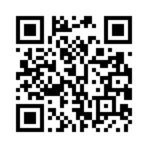
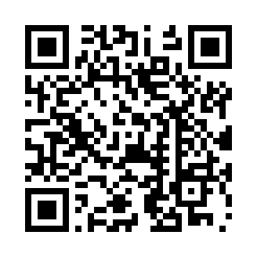
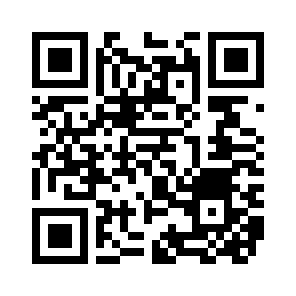

# Support Kariz

Kariz is made and maintained by one person, and it is free to run on your own servers. If it
saves you time or money and you want to help it go on, a donation is welcome. It is never
required, and nothing in Kariz depends on it.

## Donate

Send each coin **only on the network shown next to it**. A coin sent on another network
cannot be recovered. Scan the code with your wallet app, or copy the address under it.

**USDT** on the **TRON network (TRC20)**



```text
TKM87mEXhUpEBzqvNxs1qjM4EddX6VMXmw
```

**Gram (TON)** on the **TON network**



```text
UQDfjT-h4ENIrt_Sq5-zBy9TvhckniwSLCkS7zIVX4fVSaFw
```

**Bitcoin (BTC)** on the **Bitcoin network**



```text
bc1qc4cgy5etuwj2375c5zqma7xmjtk59s5s49rfp5
```

Check the first and the last characters of the address you pasted against the ones above
before you send.

## Other ways to help

Money is not the only thing that keeps a project alive:

- **Star the repository** on [GitHub](https://github.com/Erfan-XRay/Kariz): it is how others find it.
- **Report a problem** with what you did, what you expected and the log
  ([Troubleshooting](troubleshooting.md) says what to collect). A report that can be repeated
  gets fixed fastest.
- **Join the Telegram channel**, [@Erfan_Xray](https://t.me/Erfan_Xray): news, releases and answers. The panel links to it too.
- **Tell other server operators** about it.
- **Support what Kariz stands on**: the projects whose work it uses deserve the same thanks.
