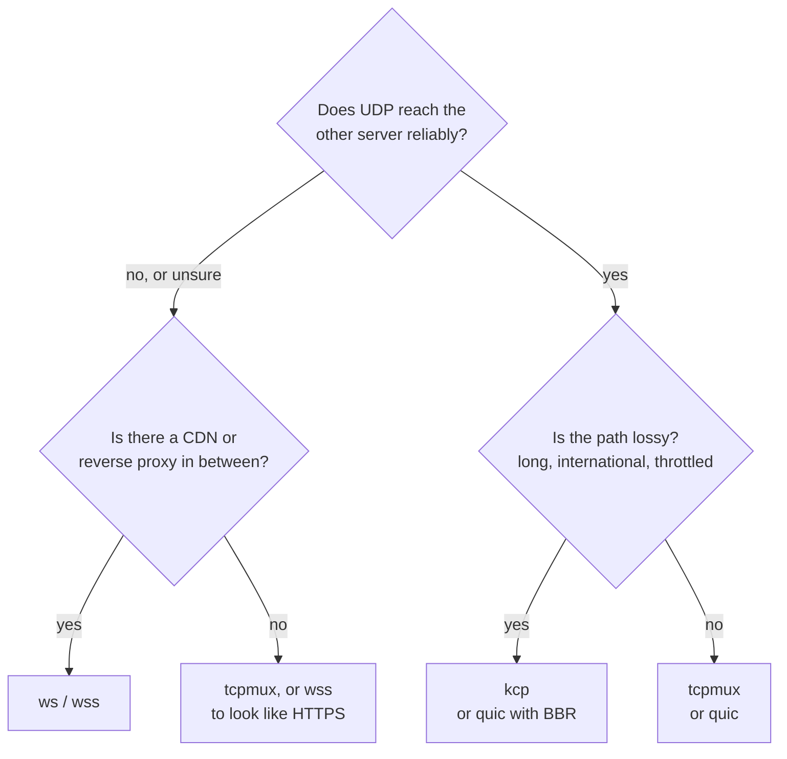

# Transports

The transport is how the tunnel travels between the two servers. It is one line,
`tunnel.transport`, and must be the same on both sides.

| Transport | What goes over the network | Use it when |
|---|---|---|
| `tcp` | one TCP connection per user connection | simple setups, the most speed on one connection |
| `tcpmux` | a few long-lived TCP connections carrying all user connections | many user connections; fewer connections between the servers |
| `ws` | WebSocket over TCP (HTTP) | behind a CDN or reverse proxy that talks HTTP to the origin |
| `wss` | WebSocket over TLS (HTTPS) | behind a CDN, or on its own to look like an HTTPS site |
| `quic` | QUIC over UDP: streams and datagrams, TLS 1.3 | UDP flows without head-of-line blocking; paths where UDP works well |
| `kcp` | KCP over UDP, every packet encrypted, optional FEC | lossy links where TCP collapses; games |

Everything except `quic` runs the same layers on top: the handshake (mutual
authentication with the token, X25519 for forward secrecy), AEAD records, and mux.

## `tcp` and `tcpmux`

`tcp` opens one tunnel connection per user connection. In reverse mode the exit keeps
`pool` connections ready so a new user does not wait for the handshake; in direct mode
the user's first bytes ride along with the handshake.

`tcpmux` is `tcp` with mux: a few long-lived connections, each carrying many streams
with their own flow control. Opening a stream costs no round trip. On Linux, Kariz sets
`TCP_NOTSENT_LOWAT` on these connections so the kernel does not hold a backlog that
UDP packets and new streams would wait behind.

Both are the fastest choice on a clean path. On a lossy one, TCP's congestion control
halves its rate on every loss: at 1 % loss on a 60 ms path, about 2 Mbit/s.

## `ws` and `wss`

A WebSocket that looks like a browser's, over plain HTTP (`ws`) or TLS (`wss`). They
work through CDNs and reverse proxies ([guide](CDN.md)).

- **Early data** (`ws.early_data = true` on the dialer) puts the tunnel hello inside
  the upgrade request, saving a round trip through the CDN.
- **Anything that is not a valid upgrade** on the configured path gets the `404` page of
  a stock nginx.
- **`wss` certificates:** a real one (Let's Encrypt), reloaded when the files change, or
  a self-signed one pinned on the dialer with `tls.pin_sha256` (`kariz pin cert.pem`).
- Keep pings at 90 s or less behind a CDN, which closes idle WebSockets after about
  100 s. `kariz check` warns otherwise.

## `quic`

QUIC (quinn), over UDP:

- Each user connection is its own QUIC stream: a lost packet delays only its own
  stream.
- UDP flows travel as QUIC datagrams. Packets too large for a datagram (above about
  1,200 bytes) go on the flow's stream instead, so they still arrive.
- Both sides prove the token with mutual TLS 1.3 using keys derived from it: no
  certificate files.
- Congestion control: `cubic` (default), `bbr` (keeps its speed under random loss, but
  fills queues; experimental in quinn) or `newreno`.
- The handshake reads as HTTP/3 (ALPN `h3`, SNI of the remote host).

Some networks throttle or block UDP, and UDP on port 443 in particular. Treat `quic` as
an option for paths where UDP works, with `tcpmux` or `wss` as the fallback.

## `kcp`

KCP is an ARQ protocol over UDP that resends aggressively and keeps its rate under
loss, where TCP collapses.

- **Every UDP packet is sealed** with a key from the token, so the port answers nothing
  else and KCP's headers are hidden. The handshake, records and mux run inside it as
  over TCP.
- **Presets** from gentle to aggressive (`normal`, `fast`, `fast2`, `fast3`) or
  `manual`.
- **FEC** (`fec_data` / `fec_parity`): Reed-Solomon parity rebuilds lost packets without
  a resend. The gaming profile turns on 10 / 3.
- **UDP flows travel beside KCP's stream**, never waiting for a lost segment. With FEC
  on, lost ones are mostly rebuilt. `datagrams = false` keeps them in the stream
  instead.
- **Its window can overfill a small path.** The default (1024 packets) is sized for
  fast links; about bandwidth x RTT / 1300 packets queues less.

KCP runs in user space, a packet at a time, so on localhost it reaches a fraction of
TCP's speed (hundreds of Mbit/s). Between two servers this rarely matters.

## Modes and transports

Every transport works in both modes. The listening side needs its port reachable:
TCP for `tcp`, `tcpmux`, `ws` and `wss`, UDP for `quic` and `kcp`.
